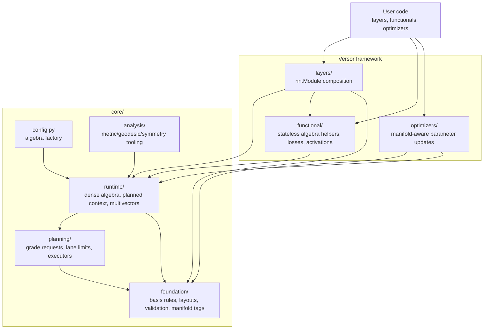
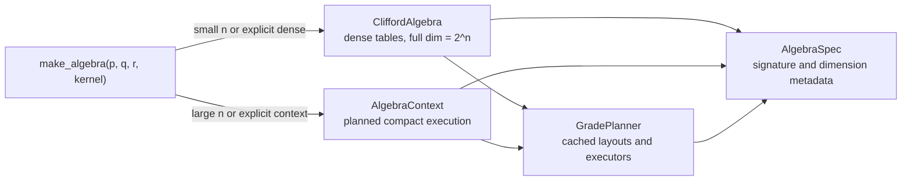
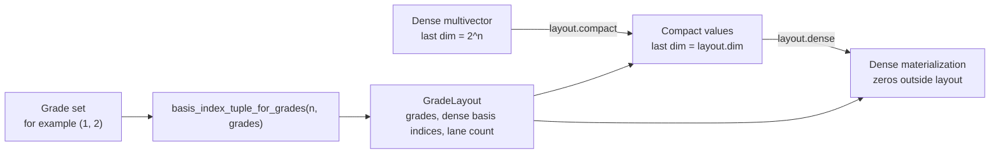
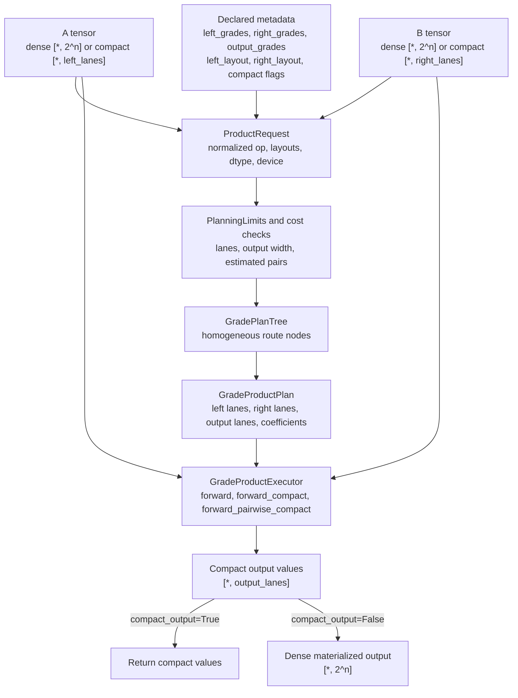
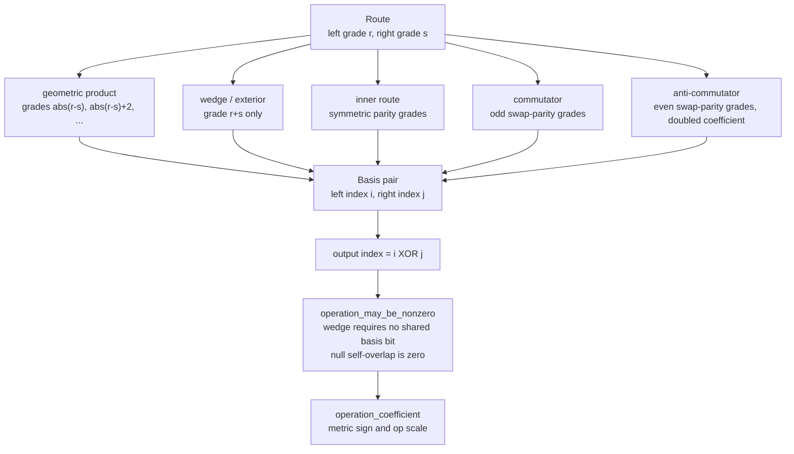
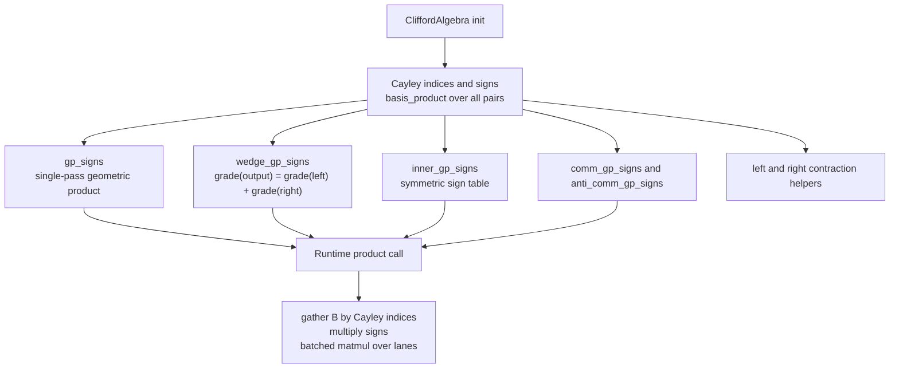
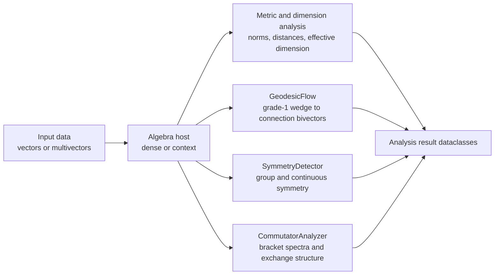
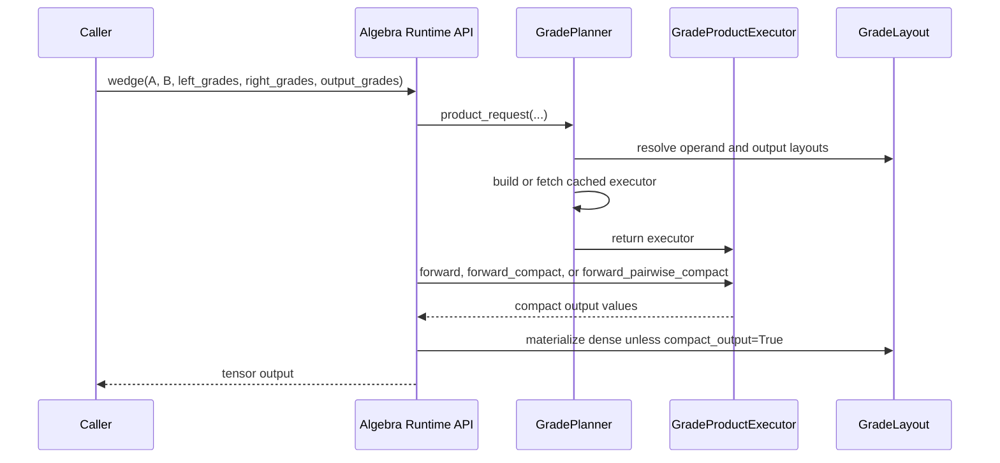

# Architecture

Versor is organized around one rule: algebraic identity, tensor layout, runtime
execution, and training behavior should stay separable. The core owns the
mathematics and the execution contracts; layers, functionals, and optimizers
expose those contracts in forms that are convenient for actual model code.

## Framework Layers



`core/` is the authority for algebra and execution. `layers/` should be thin
module wrappers around core operations. `functional/` should expose stateless
helpers and losses without duplicating runtime logic. `optimizers/` should read
parameter manifold tags and apply updates; it should not decide product plans.

## Algebra Host Selection



`CliffordAlgebra` owns dense Cayley-table buffers and fast full-layout kernels.
`AlgebraContext` exposes the same high-level product API but routes products
through static grade planning by default. Both hosts share the runtime facade, so
declared products use the same layout, cost, and executor path.

## Tensor And Layout Flow



A compact tensor is not just a shorter tensor. It is coefficient values plus a
`GradeLayout` identity that defines which dense basis blades the lanes
represent. Raw tensors do not carry that identity, so framework pipeline code
must declare `*_grades`, pass layouts, or use `Multivector` wrappers when layout
metadata needs to travel with values.

## Product Execution Flow



Planning uses static grade metadata and tensor shapes. It does not inspect
runtime tensor values. This keeps compiled paths stable and avoids
data-dependent symbolic shape extraction.

## Layer Pipeline Contract

```mermaid
sequenceDiagram
    participant Model as Model/Layers
    participant ProductLayer as ProductLayer
    participant Algebra as Algebra Runtime API
    participant Planner as GradePlanner
    participant Executor as GradeProductExecutor
    participant Optimizer as Optimizer

    Model->>ProductLayer: forward(left, right)
    ProductLayer->>Algebra: projected_product(...grades, compact flags)
    Algebra->>Planner: product_request(...)
    Planner->>Executor: cached or newly built executor
    Algebra->>Executor: forward / forward_compact / forward_pairwise_compact
    Executor-->>Model: dense or compact tensor
    Model->>Optimizer: loss.backward(); step()
    Optimizer->>Optimizer: update tagged parameters
```

Optimizers do not run planning. They update parameters after the forward pass.
Planning happens when the model calls algebra operations through direct runtime
APIs, functional helpers, `ProductLayer`, or `Multivector` methods.

## Operator Rules



The wedge implementation is the exterior product. For homogeneous inputs:

```text
A_r ^ B_s = <A_r B_s>_{r+s}
```

For vectors this coincides with `(AB - BA) / 2`, but higher-grade wedge routes
follow the grade-sum exterior definition.

## Dense Runtime



Dense products are table-driven. The input tensors carry coefficients; the
precomputed tables carry basis multiplication structure.

## Planning Limits

`PlanningLimits` centralizes static guardrails for compact planning:

```python
from clifra.core.planning import PlanningLimits
from clifra.core.runtime.context import AlgebraContext

limits = PlanningLimits(max_lanes=8192, max_pairs=16_000_000)
algebra = AlgebraContext(32, 0, device="cpu", planning_limits=limits)
```

`max_lanes` protects compact tensor width. `max_pairs` protects the
gather/reduce interaction count generated by product plans. Dense algebra hosts
and planned contexts both accept `planning_limits`, so the same policy object can
be used across framework construction.

## Analysis Flow



Analysis code should call algebra APIs rather than reconstructing basis rules.
When active grades are known, analysis should pass `left_grades`,
`right_grades`, and `output_grades` so the planner can avoid full-layout work.

## End-To-End Product Call



The same path applies to geometric product, wedge, inner route, commutator, and
anti-commutator. The operator name changes route grades and coefficients, not
the overall tensor plumbing.

## Framework Verification Map

Framework-level tests are grouped by the behavior they prove:

- Core algebra and dense kernel identities: `tests/test_core.py`
- Static grade planning and compact execution: `tests/test_grade_plan.py`
- Multivector layout-preserving wrappers: `tests/test_multivector.py`
- Layer pipeline and optimizer integration: `tests/test_framework_pipeline.py`
- Functional product helpers: `tests/test_functional_products.py`
- Optimizer manifold grouping and factories: `tests/test_riemannian_optimizer.py`

Performance checks live in `benchmarks/`. The framework pipeline benchmark
measures dense-vs-compact products, planned contexts, pairwise compact products,
and composed layer pipelines.
