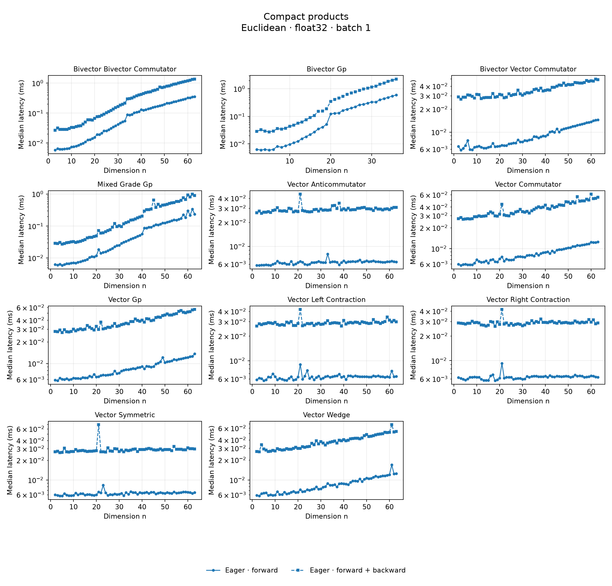
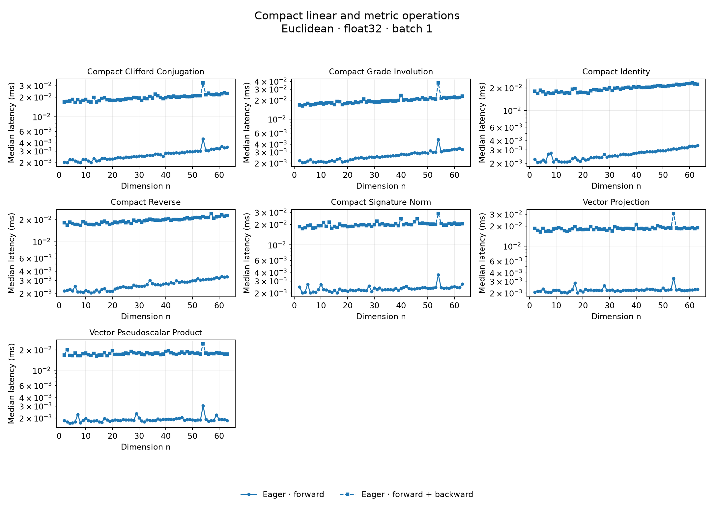
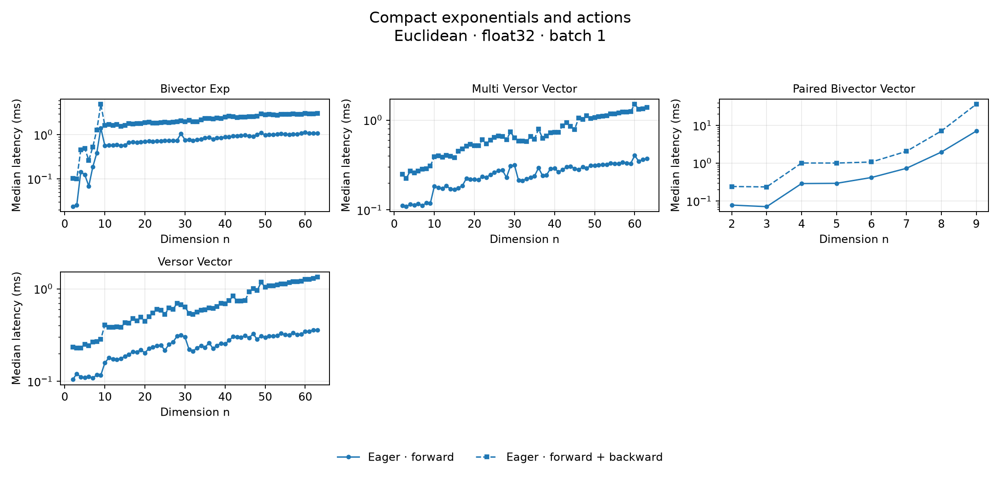
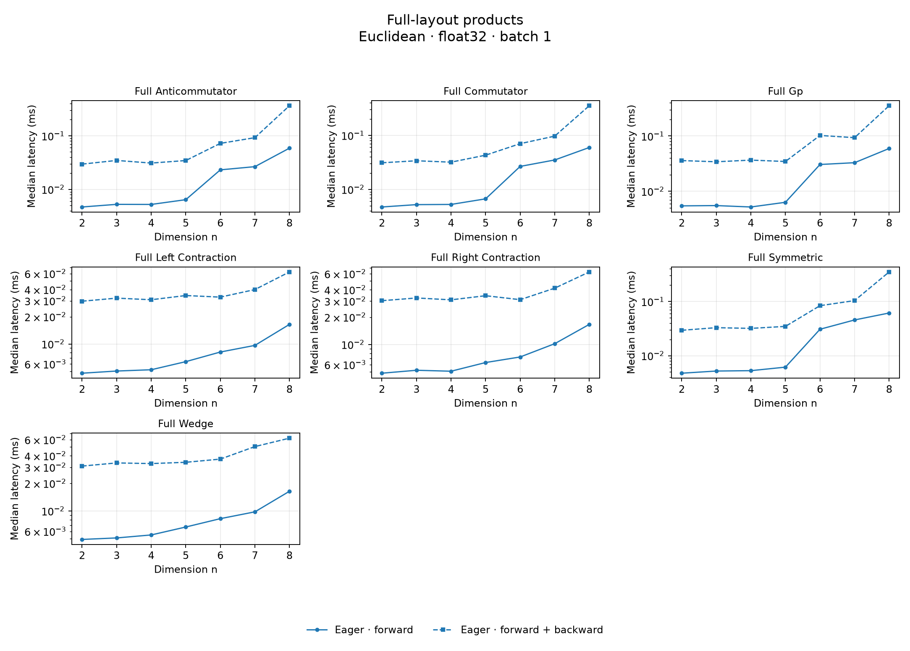
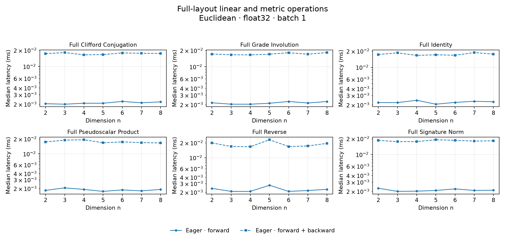
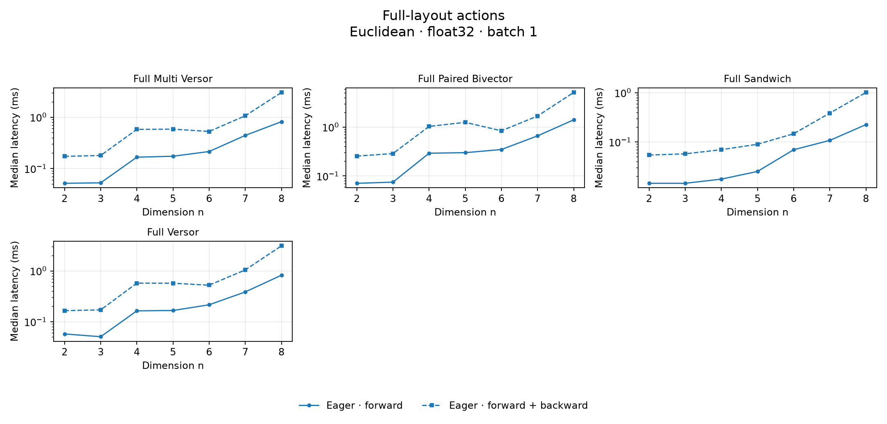
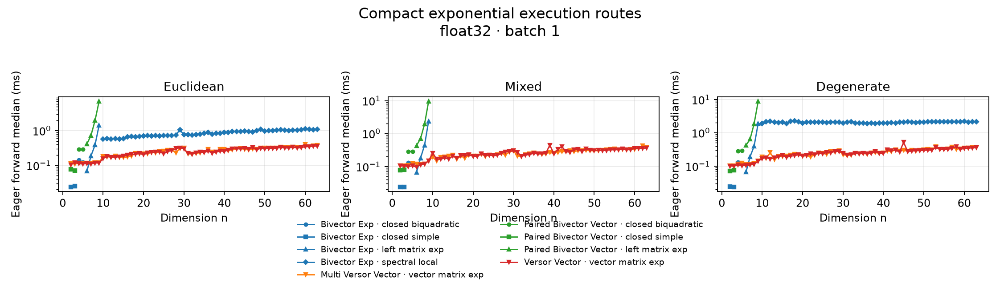
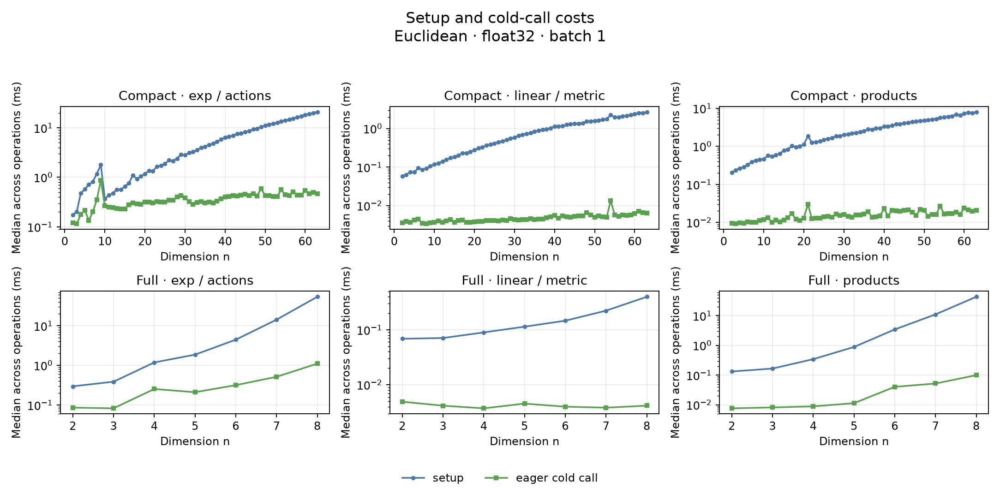
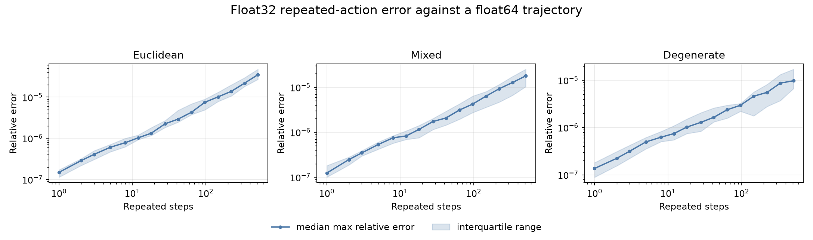

# Benchmarks

The suite measures eager forward, backward, startup, and cumulative behavior. `benchmarks/config.json` is the source of truth for the operation matrix and its dimension bounds.

## Latest Published Run

Run `20260714T022923.928479Z-4fa5b24ebc` on `macOS-26.5.2-arm64-arm-64bit` with PyTorch `2.10.0` and `5` Torch threads.

- successful rows: `15882`
- skipped cases: `0`
- errors: `0`
- cumulative samples: `720`

## Coverage

| sweep | layout | dimensions | signatures | cases | dtypes | batches | compiler modes |
| --- | --- | --- | ---: | ---: | --- | --- | --- |
| compact_layout | compact | 2–63 | 186 | 22 | float32, float64 | 1, 16 | eager |
| full_layout | full | 2–8 | 21 | 17 | float32, float64 | 1 | eager |

## Result Audit

- Output finiteness: `15882/15882` rows contain only finite values.
- Gradient finiteness: `15882/15882` measured gradients contain only finite values.
- Timing stability: `31` rows have a forward IQR greater than 50% of their median. These are retained rather than silently filtered.
- Repeated action, euclidean: median float32 maximum relative error after `512` steps is `3.506e-05`.
- Repeated action, mixed: median float32 maximum relative error after `512` steps is `1.785e-05`.
- Repeated action, degenerate: median float32 maximum relative error after `512` steps is `9.752e-06`.

## Graphs

Operation panels use Euclidean float32 with batch 1. Solid lines are forward latency; dashed lines are forward plus backward.

### Compact Layout







### Full Layout







### Execution Routes and Startup





### Repeated-operation Numerics

Float32 trajectories are compared with float64 trajectories.



## Reproduce

```bash
uv run --group benchmark benchmarks/run.py
```

See the [published configuration](artifacts/config.json) for the complete matrix.

## Artifacts

- [Configuration](artifacts/config.json)
- [Environment metadata](artifacts/metadata.json)
- [Summary](artifacts/summary.json)
- [Measurements (JSONL)](artifacts/measurements.jsonl)
- [Measurements (CSV)](artifacts/measurements.csv)
- [Cumulative profiles (JSONL)](artifacts/cumulative.jsonl)
- [Cumulative profiles (CSV)](artifacts/cumulative.csv)
- [Events (JSONL)](artifacts/events.jsonl)
- [Events (CSV)](artifacts/events.csv)

JSONL contains raw samples and complete measurement fields. CSV contains the same rows in tabular form.
