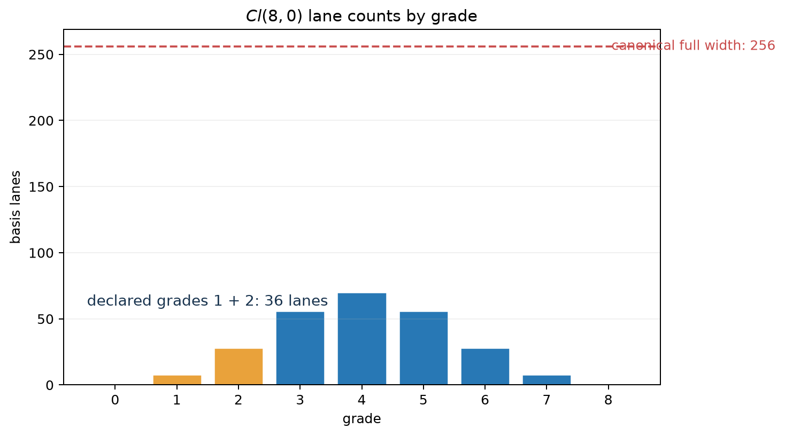

# Layout, Storage, and `TensorContract`

A Clifford algebra with $n = p + q + r$ generators has $2^n$ basis blades.
Most operations touch only a subset. A vector has $n$ coefficients, a
bivector has $n(n - 1)/2$, and a rotor generated from a bivector occupies only
even grades.

Clifra makes this distinction explicit. A layout identifies the blades a tensor
means; storage determines how those coefficients occupy the final tensor axis;
a tensor contract binds the two declarations together.

## Layout is semantic structure

`AlgebraSpec(p, q, r)` fixes the signature and the canonical basis. A
`GradeLayout` then selects grades from that basis. From the specification and
grade set it derives:

- the number of active lanes;
- each lane's canonical basis index;
- a stable lane order;
- conversions to and from other layouts for the same algebra.

For $Cl(8, 0)$, canonical storage has 256 lanes. A grade-1 layout has 8 lanes,
a grade-2 layout has 28, and a layout containing grades 1 and 2 has 36.



The layout is required semantic metadata. Two tensors with the same width can
refer to different blades, and their coefficient positions are not
interchangeable.
By carrying a `GradeLayout`, clifra can map through canonical blade indices
instead of assuming that equal positions have equal meanings.

```python
import torch

from clifra.core import make_algebra

algebra = make_algebra(4, 0, device="cpu", dtype=torch.float32)
vectors = algebra.layout((1,))       # 4 active lanes
bivectors = algebra.layout((2,))     # 6 active lanes
both = algebra.layout((1, 2))        # 10 active lanes

v = torch.arange(4, dtype=torch.float32)
v_in_both = both.convert(v, vectors)
```

The conversion places vector coefficients in their matching canonical blade
positions and fills the bivector positions with zero, preserving vector meaning
instead of inferring it from a four-lane width.

## Storage is the physical final axis

`LaneStorage` has two forms:

| Storage | Final-axis width | Meaning |
| --- | ---: | --- |
| `COMPACT` | `layout.dim` | Only the selected layout lanes are present. |
| `CANONICAL` | `2 ** n` | Every canonical blade position is addressable. |

Compact storage is the normal representation for narrow layouts. Canonical
storage is useful at explicit boundaries, for a genuinely full multivector, or
when interoperating with code that requires canonical blade positions.

A canonical-width tensor can still be interpreted through a narrow layout. In
that case the layout remains the semantic declaration; coefficients outside it
are not silently promoted into additional grades. Width validation alone does
not verify that those outside-layout coefficients are zero.

## `TensorContract` removes width ambiguity

A `TensorContract` combines three facts:

| Component | Question answered |
| --- | --- |
| `AlgebraSpec` | Which basis and signature define the coefficients? |
| `GradeLayout` | Which blades are semantically active? |
| `LaneStorage` | Are those blades compacted or placed in canonical positions? |

The resulting lane width is deterministic. Modules can validate a tensor at
their boundary, convert storage deliberately, and preserve meaning through
planned operations. This matters because shape checking alone cannot determine
whether six values are the bivectors of $Cl(4, 0)$, the vectors of $Cl(6, 0)$,
or an unrelated feature axis.

## Layout and contract helpers

The public helpers cover layout construction, lane lookup, conversion, and
boundary validation. They remove the need to reproduce the canonical blade
ordering in application code.

| Helper | Result |
| --- | --- |
| `algebra.layout(grades)` | A normalized `GradeLayout` for the algebra. |
| `algebra.grade_indices(grades)` | Canonical blade indices for a grade set on the algebra device. |
| `layout.positions_for_grades(grades)` | Compact positions occupied by the requested grades. |
| `layout.indices_tensor()` | Canonical blade indices in compact-lane order. |
| `layout.grade_indices_tensor()` | One grade number for each compact lane. |
| `target.convert(values, source)` | Direct conversion between compact layouts, with missing target lanes set to zero. |
| `layout.compact(values)` | Selection of the layout lanes from canonical storage. |
| `layout.full(values)` | Placement of compact values into canonical storage. |
| `TensorContract.compact(...)` | A compact-storage contract for a layout. |
| `TensorContract.canonical(...)` | A canonical-storage contract with explicit layout semantics. |
| `contract.validate(values)` | Validation of the final coefficient axis. |
| `contract.validate_input(values, channels=..., name=...)` | Validation of channel and coefficient axes at a layer boundary. |
| `contract.to_compact(values)` / `to_canonical(values)` | Storage conversion under a fixed contract. |
| `contract.grade_positions(grade)` | Grade positions in the contract's storage form. |
| `resolve_layout(...)` / `resolve_contract(...)` | Normalization of explicit layout, grade, and storage arguments. |
| `infer_contract(...)` | Storage inference from width at an external boundary, followed by validation. |
| `compact_values(...)` / `canonical_values(...)` | Conversion at a public boundary when compact or canonical input is accepted. |

`positions_for_grades` returns positions in compact storage, whereas
`indices_tensor` returns canonical blade indices. Use the former to select lanes
from a compact tensor and the latter only when a canonical index is required.

`algebra.embed_vector` is a specialized convenience function. It maps ordinary
vector coordinates to canonical full storage. `ProjectiveEmbedding` and
`ConformalEmbedding` provide layout-aware adapters for their respective models.
Use `layout.convert`, `compact`, or `full` when the source already consists of
Clifford coefficients.

## Format for project-specific helpers

A reusable helper should fix or expose its tensor contract. For an `nn.Module`,
store the layout and contract on the module and register lane positions or masks
as buffers. A stateless function should accept an explicit layout or contract;
if the output contract is not fixed by its API, return it with the tensor.

The final axis remains the Clifford coefficient axis. Leading batch, sample,
and channel axes should pass through unchanged. Allocate outputs with
`values.new_zeros` or an equivalent tensor method so device and dtype are
preserved.

```python
import torch
import torch.nn as nn

from clifra.core import AlgebraSpec, GradeLayout, TensorContract


class CompactVectorAdapter(nn.Module):
    def __init__(self, algebra, layout: GradeLayout) -> None:
        super().__init__()
        spec = AlgebraSpec.from_algebra(algebra)
        self.n = spec.n
        self.layout = layout
        self.contract = TensorContract.compact(spec, layout)

        positions = layout.positions_for_grades((1,), device=algebra.device)
        if positions.numel() != self.n:
            raise ValueError("layout must contain the complete grade-1 basis")
        self.register_buffer("_vector_positions", positions)

    def embed(self, coordinates: torch.Tensor) -> torch.Tensor:
        if coordinates.shape[-1] != self.n:
            raise ValueError(f"expected {self.n} coordinates")
        output = coordinates.new_zeros(
            *coordinates.shape[:-1], self.contract.lane_dim
        )
        return output.index_copy(-1, self._vector_positions, coordinates)

    def extract(self, values: torch.Tensor) -> torch.Tensor:
        self.contract.validate(values)
        return torch.index_select(values, -1, self._vector_positions)
```

The format keeps indices out of call sites, moves static lane discovery out of
`forward`, and exposes `layout` and `contract` to downstream code. Helpers
that support both storage forms should use separate contracts or require an
explicit `LaneStorage`; shape-based inference should be limited to a public
boundary and resolved immediately to a contract.

## Static sparsity, dense tensor execution

`GradeLayout` represents statically known sparsity. Unlike a dynamic format such
as COO or CSR, the algebra and grade declaration determine its structure before
tensor values arrive. Planning then uses it to build the required interactions:

1. The left, right, and output layouts determine possible grade paths.
2. Metric-zero and projection-zero products are removed from the realized plan.
3. Blade positions and product coefficients become registered tensor buffers.
4. Runtime execution gathers active lanes, multiplies them, and reduces them
   with ordinary PyTorch tensor operations.

The execution model has two properties:

- **Sparse structural cost:** inactive blades and impossible grade paths do not
  need coefficient storage or runtime interactions.
- **Dense numerical representation:** batch and channel axes remain ordinary
  dense tensors, so broadcasting, autograd, modules, device placement, and
  compilation remain available.

The product executor therefore works with a compact dense coefficient axis and
uses the structure computed during planning. For a planned product, its
equivalent hot path is conceptually:

```text
gather declared left lanes
gather declared right lanes
multiply by fixed signature coefficients
reduce into declared output lanes
```

Full all-grade products may instead select a full-table executor. That route is
only meaningful when both inputs and the output are canonical all-grade
layouts; executor policy decides whether its dense table is preferable to the
grade-planned route.

## Storage and computation limits

Layouts remove work that the declaration proves unnecessary. A vector-to-vector
operation projected to scalars and bivectors need not allocate arbitrary grades.
A bivector field need not carry a $2^n$-wide parameter tensor merely because
its exponential may later produce several even grades.

Clifford algebra's combinatorial growth still applies. A request for all grades
has $2^n$ lanes, and a narrow output can still require many input pairs. Some
operations, notably general bivector exponentiation, may need a larger
intermediate representation than their inputs. Planning limits and execution
policies make these costs explicit; declared costs can still be large.

The default representation should use the narrowest layout required by the
operation. Preserve the contract at module boundaries and expand only at an
operation that requires canonical storage or additional grades.
