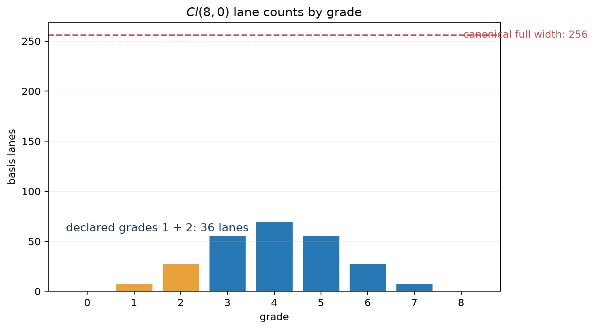

# Layout, Storage, and `TensorContract`

A Clifford algebra with $n = p + q + r$ generators has $2^n$ basis blades.
Most operations touch only a subset. A vector has $n$ coefficients, a
bivector has $n(n - 1)/2$, and a rotor generated from a bivector occupies only
even grades.

clifra makes this distinction explicit. A layout identifies which blades a
tensor represents; storage determines how those coefficients occupy the final
tensor axis; a tensor contract binds the two declarations together.

## Basis and lane order

Basis blades use increasing bitmask order. Bit $i-1$ denotes $e_i$;
the set bits give the ordered product of basis vectors. In $Cl(3,0)$ the
canonical order is

\[
1,\ e_1,\ e_2,\ e_{12},\ e_3,\ e_{13},\ e_{23},\ e_{123}.
\]

A compact layout retains this order after selecting grades. Lanes are not
grouped by grade: a layout of grades 1 and 2 has order
$e_1,e_2,e_{12},e_3,e_{13},e_{23}$.

## Layout is semantic structure

`AlgebraSpec(p, q, r)` fixes the signature and the canonical basis. A
`GradeLayout` then selects grades from that basis. From the specification and
grade set it derives:

- the number of active lanes;
- each lane's canonical basis index;
- a stable lane order;
- conversions to and from other layouts for the same algebra.

For $Cl(8, 0)$, canonical storage has 256 lanes. A grade-1 layout has 8 lanes,
a grade-2 layout has 28, and a layout containing grades 1 and 2 has 36.



The layout is required semantic metadata. Two tensors with the same width can
refer to different blades, and their coefficient positions are not
interchangeable.
By carrying a `GradeLayout`, clifra can map through canonical blade indices
instead of assuming that equal positions have equal meanings.

```python
import torch

from clifra.core import make_algebra

algebra = make_algebra(4, 0, device="cpu", dtype=torch.float32)
vectors = algebra.layout((1,))       # 4 active lanes
bivectors = algebra.layout((2,))     # 6 active lanes
both = algebra.layout((1, 2))        # 10 active lanes

v = torch.arange(4, dtype=torch.float32)
v_in_both = both.convert(v, vectors)
```

The conversion places vector coefficients in their matching canonical blade
positions and fills the bivector positions with zero, preserving vector meaning
instead of inferring it from a four-lane width.

## Storage is the physical final axis

`LaneStorage` has two forms:

| Storage | Final-axis width | Meaning |
| --- | ---: | --- |
| `COMPACT` | `layout.dim` | Only the selected layout lanes are present. |
| `CANONICAL` | `2 ** n` | Every canonical blade position is addressable. |

Compact storage is the normal representation for narrow layouts. Canonical
storage is useful at explicit boundaries, for a genuinely full multivector, or
when interoperating with code that requires canonical blade positions.

A canonical-width tensor can still be interpreted through a narrow layout. In
that case the layout remains the semantic declaration; coefficients outside it
are not silently promoted into additional grades. Width validation alone does
not verify that those outside-layout coefficients are zero.

## `TensorContract` removes width ambiguity

A `TensorContract` combines three facts:

| Component | Question answered |
| --- | --- |
| `AlgebraSpec` | Which basis and signature define the coefficients? |
| `GradeLayout` | Which blades are semantically active? |
| `LaneStorage` | Are those blades compacted or placed in canonical positions? |

The resulting lane width is deterministic. Modules can validate a tensor at
their boundary, convert storage deliberately, and preserve meaning through
planned operations. This matters because shape checking alone cannot determine
whether six values are the bivectors of $Cl(4, 0)$, the vectors of $Cl(6, 0)$,
or an unrelated feature axis.

## Layout and contract helpers

The public helpers cover layout construction, lane lookup, conversion, and
boundary validation. They remove the need to reproduce the canonical blade
ordering in application code.

| Helper | Result |
| --- | --- |
| `algebra.layout(grades)` | A normalized `GradeLayout` for the algebra. |
| `layout.positions_for_grades(grades)` | Compact positions occupied by the requested grades. |
| `layout.indices_tensor()` | Canonical blade indices in compact-lane order. |
| `layout.grade_indices_tensor()` | One grade number for each compact lane. |
| `target.convert(values, source)` | Direct conversion between compact layouts, with missing target lanes set to zero. |
| `layout.compact(values)` | Selection of the layout lanes from canonical storage. |
| `layout.full(values)` | Placement of compact values into canonical storage. |
| `TensorContract.compact(...)` | A compact-storage contract for a layout. |
| `TensorContract.canonical(...)` | A canonical-storage contract with explicit layout semantics. |
| `contract.validate(values)` | Validation of the final coefficient axis. |
| `contract.to_compact(values)` / `to_canonical(values)` | Storage conversion under a fixed contract. |

`positions_for_grades` returns positions in compact storage, whereas
`indices_tensor` returns canonical blade indices. Use the former to select lanes
from a compact tensor and the latter only when a canonical index is required.

## Tensor axes and composition

The final axis holds Clifford coefficients. Leading axes are ordinary tensor
dimensions. For a product, shapes `[batch, 1, left_lanes]` and
`[channels, right_lanes]` broadcast to
`[batch, channels, output_lanes]`.

With `pairwise=True`, the penultimate axes are explicit item axes:
`[..., L, left_lanes]` and `[..., R, right_lanes]` produce
`[..., L, R, output_lanes]`. Remaining prefixes broadcast normally.

A layout passed to an operation declares compact storage. Use
`TensorContract.canonical(layout)` for canonical storage with that layout.
Omitted input declarations mean the full basis. Width validates a declaration;
it never selects the layout or storage mode.

Compact tensors compose directly with PyTorch. Addition requires aligned lane
meanings; use `target.convert(values, source)` before combining different
layouts. Scalar multiplication and leading-axis reshaping preserve the layout
when they leave coefficient positions intact.

## Storage and computation

Layouts describe static grade structure, independent of coefficient values.
Products can exclude absent blades, impossible grade paths, and metric-zero
interactions before execution. Compact storage remains a dense tensor with
ordinary broadcasting and autograd.

Clifford algebra's combinatorial growth still applies. A request for all grades
has $2^n$ lanes, and a narrow output can require many input pairs. General
bivector exponentiation may need a larger intermediate representation than its
input. See [Bivector Exponentials and Actions](bivector-exponential.md) for the
distinction between storing an exponential and applying its action.
