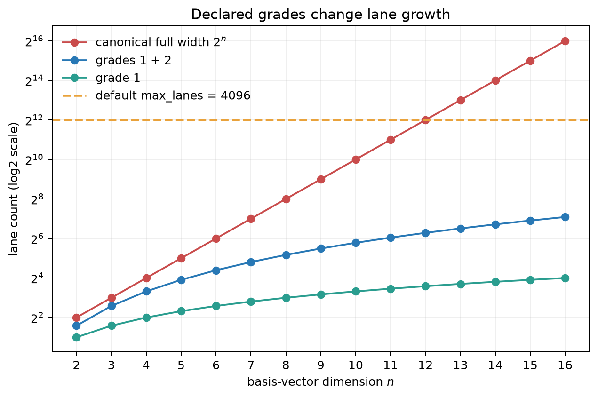

# Planning Policy as Dependency Injection

The algebra defines which products are mathematically valid. Memory budgets,
plan rejection thresholds, and backend-specific executor choices are
operational decisions, so clifra receives them as injected policy.

## Inject policy when the algebra is constructed

Policies are created before the algebra and passed to `make_algebra`:

```python
import torch

from clifra.core import BivectorExpExecutionPolicy, PlanningLimits, make_algebra
from clifra.core.planning import ProductExecutionPolicy

limits = PlanningLimits(
    warn_lanes=4_096,
    max_lanes=8_192,
    warn_pairs=2_000_000,
    max_pairs=12_000_000,
)

product_policy = ProductExecutionPolicy(
    cpu_full_table_pair_weight=0.9,
    cpu_sparse_pair_weight=1.4,
)

exp_policy = BivectorExpExecutionPolicy(
    spectral_transition_n=10,
    spectral_max_planes=4,
)

algebra = make_algebra(
    10,
    0,
    device="cpu",
    dtype=torch.float32,
    planning_limits=limits,
    product_execution_policy=product_policy,
    bivector_exp_execution_policy=exp_policy,
)
```

The algebra host stores these objects. Layout validation, planners, and layers
created from that host use the same policies. `AlgebraConfig` and
`make_algebra_from_config` provide the same injection points for configuration-
driven applications.

Injection has three consequences:

- two algebras in one process can use different budgets and cost models;
- tests or analysis can use strict limits without changing global state;
- the policy that produced a plan can be kept with the experiment configuration.

Replacing a policy object leaves existing plans unchanged. Constructing the
policy first makes it clear which policy produced each plan.

## `PlanningLimits`: reject static costs before allocation

`PlanningLimits` contains warning and hard thresholds for lane widths and
bilinear interaction counts. The defaults are:

| Limit | Default |
| --- | ---: |
| `warn_lanes` | 2,048 |
| `max_lanes` | 4,096 |
| `warn_pairs` | 1,000,000 |
| `max_pairs` | 8,000,000 |

Warnings begin at the warning threshold and are emitted once for an equivalent
static cost. A value above a maximum raises an error before broad executor data
is materialized.



Lane and pair limits protect different resources. A layout may be narrow while
a product of two such layouts creates many candidate interactions. Conversely,
a broad output layout may be expensive to store even when relatively few pairs
contribute to it.

The preflight pair count is conservative. It can use the product of declared
input widths to reject a request above the configured pair bound before constructing all
basis interactions. The realized plan may contain fewer pairs after grade,
projection, and metric-zero filtering.

These limits regulate operational cost; mathematical validity is unchanged.
Raising or removing them means that the caller accepts the resulting allocation
and planning cost.

## `ProductExecutionPolicy`: choose an executor by a static score

Clifra has two product executor families:

- the sparse grade-planned executor, which stores only selected interactions;
- the full-table executor, available only when both inputs and the output are
  all-grade layouts and the full lane count is within its configured cap.

For a declared request, planning first builds a grade-path tree. It then
estimates pair counts and buffer bytes for both eligible families. In simplified
form, each score is:

\[
S = w_p N_{\mathrm{pairs}} + w_g N_{\mathrm{paths}}
  + w_o N_{\mathrm{output}}
  + w_m \frac{B_{\mathrm{estimated}}}{B_{\mathrm{unit}}}.
\]

The policy supplies separate weights for full-table and sparse execution on
CPU, MPS, and the default backend group. The lower eligible score is selected.
For non-full layouts, sparse execution is mandatory because a full table does
not represent the declared compact contract.

The estimated buffers account for more than coefficient values. A full table
uses canonical product indices and coefficients; a sparse plan stores left,
right, output, and coefficient data for its realized interactions. The formula
is intentionally static: it depends on layouts, signature, dtype, and device,
not on the tensor values of a particular batch.

Executor policy changes the implementation of an operation, not its algebraic
definition. Both exact product executors use the same basis-product signs and
output projection.

## `BivectorExpExecutionPolicy`: select a numerical method

Bivector exponentiation has a separate policy because its alternatives are not
merely two storage strategies. The policy controls the transition to the
spectral-local method, the maximum retained planes, numerical tolerances, and
handling of degenerate signatures. Signature, dimension, dtype, and backend
also constrain eligibility.

Unlike exact product executor selection, a capped spectral-local route can be
an approximation. Its policy must therefore be justified with angle-spectrum
and drift analysis for the intended workload. Detailed constraints are covered
in [Bivector Exponential Methods](bivector-exponential.md).

## Defaults are presets, not learned decisions

The default weights provide a usable starting policy without profiling a machine
or fitting values during import. Automatic profiling would make algebra
construction stateful, slow, and difficult to reproduce; a result measured on
one batch or compiler may also be a poor policy for another workload.

To tune a policy:

1. Measure representative signatures, layouts, grades, dtypes, batches, and
   devices with the benchmark suite.
2. Compare the executor families or exponential routes relevant to the model.
3. Adjust weights, caps, or limits to reflect those measurements.
4. Inject the resulting immutable policy before constructing the algebra.
5. Store it with the experiment or deployment configuration.

The planner receives an operational decision model. The application owns its
calibration and configuration.
