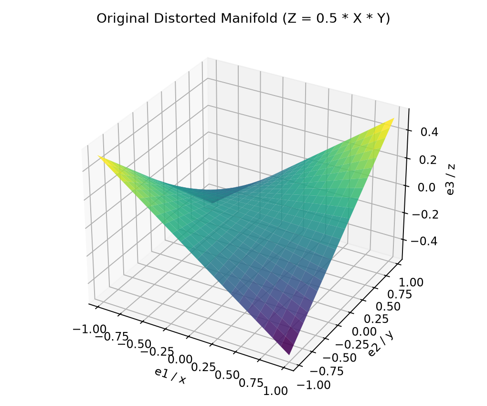
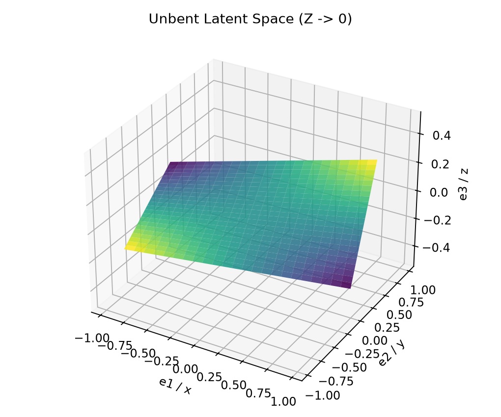
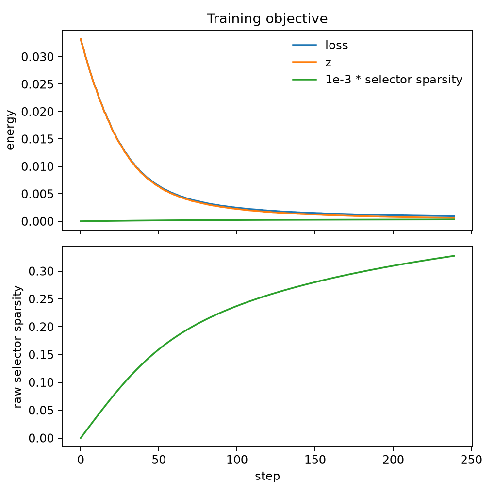
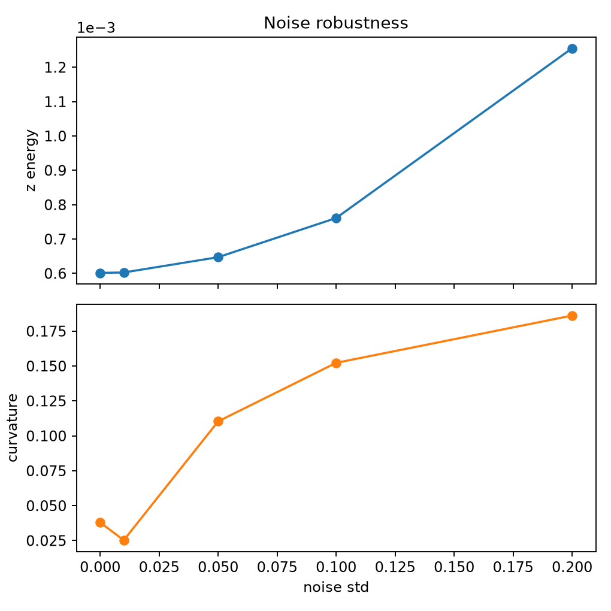

# First Guide

This is the smallest complete Clifra guide: sample a distorted 3-D manifold
from formulas, pass it through a grade-2 rotor layer, penalize unwanted energy,
inspect `core.analysis`, and save the plots.

The surface is a grid patch:

```text
z = 0.5 * x * y
```

`RotorLayer` below is the grade-2 `VersorLayer`. In Clifra, `grade=2` learns a
bivector, exponentiates it to a rotor, and applies the rotor action.





## Imports

```python
import torch

from clifra import make_algebra
from clifra.core.foundation import CliffordModule
from clifra.core.analysis import AnalysisConfig, GeometricAnalyzer
from clifra.core.analysis.geodesic import GeodesicFlow
from clifra.layers import BladeSelector, VersorLayer as RotorLayer
from clifra.optimizers import make_riemannian_optimizer
```

## Sample The Manifold

`Cl(3, 0)` has eight full-lane coefficients. Vector coordinates occupy lanes
`e1`, `e2`, and `e3`, whose canonical indices are `1`, `2`, and `4`.

```python
def sample_patch(algebra, n: int = 24) -> tuple[torch.Tensor, tuple[int, int]]:
    x = torch.linspace(-1.0, 1.0, n, device=algebra.device, dtype=algebra.dtype)
    y = torch.linspace(-1.0, 1.0, n, device=algebra.device, dtype=algebra.dtype)
    X, Y = torch.meshgrid(x, y, indexing="ij")
    Z = 0.5 * X * Y

    xyz = torch.stack((X.reshape(-1), Y.reshape(-1), Z.reshape(-1)), dim=-1)
    return algebra.embed_vector(xyz).unsqueeze(1), (n, n)  # [N, C=1, 8]
```

## Build The Unbender

A grade-2 rotor action followed by a Blade
selector. The selector starts as pass-through and learns which lanes to keep.

```python
class Unbending(CliffordModule):
    """Align the manifold and filter the residual energy."""

    def __init__(self, algebra):
        super().__init__(algebra)
        full_layout = algebra.layout(range(algebra.n + 1))
        self.rotor = RotorLayer(
            algebra,
            channels=1,
            grade=2,
            input_layout=full_layout,
            output_layout=full_layout,
        )
        self.selector = BladeSelector(algebra, channels=1, layout=full_layout)

    def forward(self, x):
        return self.selector(self.rotor(x))

    def sparsity_loss(self):
        return self.selector.weights.abs().mean()
```

## Define The Loss

The loss has two terms:

| Term | Purpose |
| --- | --- |
| `z_energy` | pushes the `e3` coordinate toward zero |
| `selector_sparsity` | keeps the blade selector gate simple |

```python
def loss_terms(model, noisy):
    output = model(noisy)

    z_energy = (output[..., 4] ** 2).mean()
    selector_sparsity = model.sparsity_loss()
    weighted_selector_sparsity = 1.0e-3 * selector_sparsity

    loss = z_energy + weighted_selector_sparsity
    metrics = {
        "loss": loss.detach(),
        "z": z_energy.detach(),
        "selector_sparsity": selector_sparsity.detach(),
        "weighted_selector_sparsity": weighted_selector_sparsity.detach(),
    }
    return loss, output, metrics
```

## Train

```python
torch.manual_seed(7)

algebra = make_algebra(3, 0, device="cpu", dtype=torch.float32)
data, grid_shape = sample_patch(algebra)
model = Unbending(algebra)
flow = GeodesicFlow(algebra, k=10)
optimizer = make_riemannian_optimizer(
    model,
    algebra,
    optimizer="adam",
    lr=0.03,
    max_bivector_norm=1.2,
)

history = []
for step in range(240):
    noisy = data + torch.randn_like(data) * 0.01
    optimizer.zero_grad()
    loss, output, metrics = loss_terms(model, noisy)
    loss.backward()
    optimizer.step()
    history.append({"step": step, **{key: float(value) for key, value in metrics.items()}})

with torch.no_grad():
    unbent = model(data)
```

## Inspect

```python
def measure(flow, values, model=None):
    metrics = {
        "z": float((values[..., 4] ** 2).mean()),
        "curvature": flow.curvature(values.squeeze(1)),
    }
    if model is not None:
        metrics["selector_sparsity"] = float(model.sparsity_loss().detach())
    return {
        key: round(value, 6)
        for key, value in metrics.items()
    }


raw_metrics = measure(flow, data)
unbent_metrics = measure(flow, unbent, model)
print("raw   ", raw_metrics)
print("unbent", unbent_metrics)
```

Representative run:

```text
raw    {'z': 0.032819, 'curvature': 0.106277}
unbent {'z': 0.000602, 'curvature': 0.037979, 'selector_sparsity': 0.327828}
```

`GeometricAnalyzer` can consume the same full-lane output in pre-embedded mode:

```python
analyzer = GeometricAnalyzer(
    AnalysisConfig(
        device="cpu",
        dtype=algebra.dtype,
        run_dimension=False,
        run_signature=False,
    )
)
report = analyzer.analyze(unbent, algebra=algebra)
print(report.summary())
```

Representative run:

```text
=== Geometric Analysis Report ===

[Spectral]
  Grade energy: [0.0000, 0.7252, 0.0000, 0.0000]
  Bivector spectrum: [0.0000]
  GP eigenvalues (top 5): [0.0265, 0.0265, 0.0265, 0.0265, 0.0265]

[Symmetry]
  Null directions: [2]
  Involution symmetry: 1.0000
  Continuous symmetry dim: 4
  Reflection symmetries: 3 detected

[Commutator]
  Mean commutator norm: 0.0000
  Exchange spectrum (top 5): [0.0000, 0.0000, 0.0000, 0.0000, 0.0000]
  Lie bracket closure error: 0.0000

[Metadata]
  data_shape: [576, 1, 8]
  config_device: cpu
  elapsed_seconds: 0.01
```

## Noise Check

```python
def noise_test(model, flow, data):
    rows = []
    for noise_std in [0.0, 0.01, 0.05, 0.1, 0.2]:
        noisy = data + torch.randn_like(data) * noise_std
        with torch.no_grad():
            output = model(noisy)
        rows.append({"noise": noise_std, **measure(flow, output, model)})
    return rows


noise_rows = noise_test(model, flow, data)
```






## Plot

The plotting code reads full-lane vector coordinates directly. In `Cl(3, 0)`,
`values[..., 1]`, `values[..., 2]`, and `values[..., 4]` are x, y, and z.

```python
def xyz(values):
    flat = values.detach().cpu()
    if flat.ndim == 3:
        flat = flat[:, 0, :]
    return flat[:, 1], flat[:, 2], flat[:, 4]


def plot_patch(values, grid_shape, title, path):
    import matplotlib.pyplot as plt

    x, y, z = xyz(values)
    n0, n1 = grid_shape
    fig = plt.figure(figsize=(6, 5))
    ax = fig.add_subplot(111, projection="3d")
    ax.plot_surface(
        x.reshape(n0, n1),
        y.reshape(n0, n1),
        z.reshape(n0, n1),
        cmap="viridis",
        linewidth=0,
        alpha=0.88,
    )
    ax.set_title(title)
    ax.set_xlabel("e1 / x")
    ax.set_ylabel("e2 / y")
    ax.set_zlabel("e3 / z")
    fig.tight_layout()
    fig.savefig(path, dpi=170)
    plt.close(fig)
```

## What This Shows

| Piece | Role |
| --- | --- |
| `make_algebra(3, 0)` | 3-D Euclidean Clifford algebra |
| `algebra.embed_vector(xyz)` | Formula samples into full-lane multivectors |
| `RotorLayer(..., grade=2)` | `VersorLayer` in rotor mode |
| `BladeSelector` | Learned lane gate after rotor alignment |
| `output[..., 4] ** 2` | z-energy pressure for flattening |
| `model.sparsity_loss()` | Simple blade-selector regularization |
| `GeodesicFlow` | Local curvature metric for analysis |
| `GeometricAnalyzer` | Broader `core.analysis` report over the result |
