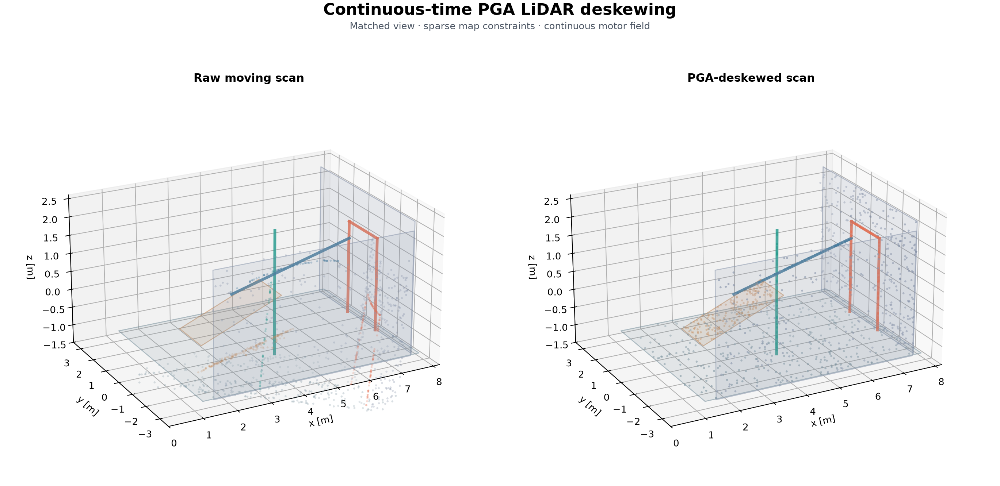
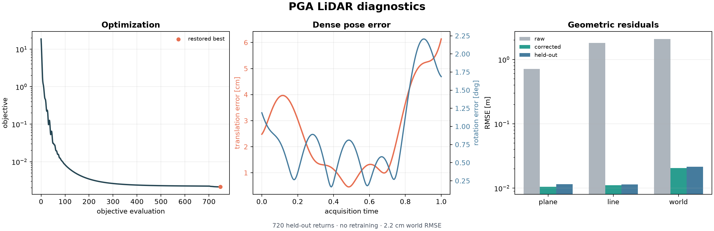

# Continuous-Time PGA LiDAR Deskewing

This experiment recovers continuous ego-motion from a motion-distorted 3-D
scan using dual projective geometric algebra \(Cl(3,0,1)\). Planes are
1-vectors, lines are 2-vector meets, and Euclidean points are 3-vectors.
Acquisition time remains attached to each return as the sampling identity for
the learned motor field.



## Experiment

A static synthetic scene is scanned while the sensor follows an independently
defined analytic translating and rotating trajectory. The scan has 1,160 timed
returns; the optimizer uses 183 selected returns, with 104 known point-plane
correspondences, 60 known point-line correspondences, and 24 surveyed point
anchors. Some selected returns carry more than one constraint. The anchor
positions come from simulation truth, but the analytic trajectory and all
unselected world points are used only for synthesis and evaluation.

The estimator is a normalized Gaussian-RBF PGA motor field, deliberately
different from the analytic matrix trajectory used to generate the scan.
Evaluation includes a second independently sampled 720-return scan and a dense
241-time pose comparison, with no validation-time optimization.

| Quantity | Raw | Corrected / recovered |
| --- | ---: | ---: |
| Primary plane RMSE | 0.713 m | 0.0105 m |
| Primary line RMSE | 1.809 m | 0.0111 m |
| Primary world RMSE | 2.082 m | 0.0206 m |
| Held-out plane RMSE | 0.735 m | 0.0115 m |
| Held-out line RMSE | 1.801 m | 0.0114 m |
| Held-out world RMSE | 2.127 m | 0.0216 m |
| Dense translation RMSE | — | 3.03 cm |
| Dense rotation RMSE | — | 1.04° |
| Indexed inverse round-trip max | — | \(1.2\times10^{-14}\) |

The surveyed anchors help resolve pose directions weakly constrained by the
map: the late sweep observes planes but no lines. Anchor-free full-scale fits
can reduce point-plane and point-line residuals while missing the dense
trajectory. The analytic trajectory and simulation oracle are not supplied to
the optimization objective.



Recorded default run summary:

```text
setup         1160 timed returns | 183 selected returns | 10 RBF controls | seed 29
[   0/700] loss=1.8722e+01 plane=0.7011 line=1.7937
[ 700/700] loss=2.2323e-03 plane=0.0126 line=0.0105 anchor=0.0085
[L-BFGS/45] loss=2.1256e-03
primary      plane 0.7126→0.0105 m | line 1.8088→0.0111 m | world 2.0821→0.0206 m
validation   720 held-out returns | plane 0.0115 m | line 0.0114 m | world 0.0216 m
numerical    pose 3.03 cm / 1.036° | inverse 1.2e-14
optimization best 2.126e-03 at 747 | final 2.126e-03 | 183 selected returns
```

## Run

```bash
uv run --group viz research/transformation_fields/examples/pga_lidar_deskewing.py
```

Add `--live` to display the evolving deskewed scan. Saved artifacts are written
to `outputs/pga_lidar_deskewing/`.
