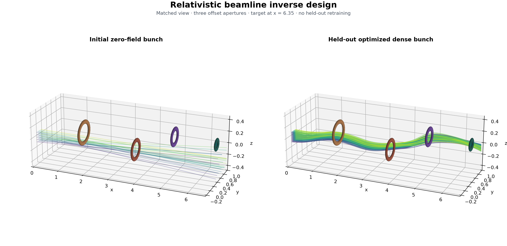
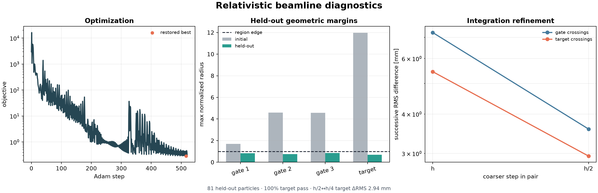

# Relativistic Beamline Inverse Design

This experiment optimizes a spatially varying electromagnetic bivector field in
\(Cl(1,3)\) to steer a relativistic particle bunch through three offset
apertures and onto a compact target. Natural units \(c=q/m=1\) are used.
Four-velocity updates are Lorentz rotor actions; worldlines are integrated in
proper time.



## Experiment

Eleven longitudinal control sites parameterize six field channels with local
\(C^1\) cubic interpolation along the beamline. The optimization uses 25
particles. Its objective combines aperture and target geometry, focusing,
direction and energy terms, forward-motion constraints, and compact field
regularization.

The restored field is then evaluated without retraining on an off-grid
\(9\times9\) transverse phase-space grid containing 81 held-out particles.
A separate \(h\), \(h/2\), \(h/4\) refinement study evaluates sensitivity to
proper-time discretization.

| Quantity | Optimized / held-out result |
| --- | ---: |
| Optimized gate max normalized radii | 0.765, 0.771, 0.699 |
| Held-out gate max normalized radii | 0.838, 0.754, 0.851 |
| Held-out target pass fraction | 100% |
| Held-out target max normalized radius | 0.683 |
| Held-out target RMS spread | 31.7 mm |
| Held-out target centroid error | 11.8 mm |
| Held-out mean \(\gamma\) | 1.659 |
| Held-out mass-shell max error | \(5.1\times10^{-14}\) |

Successive crossing differences decrease under refinement. From \(h/2\) to
\(h/4\), the held-out RMS change is 3.59 mm at the gates and 2.94 mm at the
target. The refinement is reported as observed convergence behavior rather than
as a formal convergence-order estimate.



Recorded default run summary:

```text
setup         25 optimization particles | 11 field sites | 144 steps at h=0.042
[   0/520] loss=2.9384e+03 gate=0.3287 focus=0.1556 gamma=1.539
[ 520/520] loss=2.9677e-01 gate=0.0386 focus=0.0234 gamma=1.656
validation   81 held-out particles | target 100.0% | spread 31.67 mm | centroid 11.85 mm
refinement   target ΔRMS 5.45→2.94 mm | gate ΔRMS 7.25→3.59 mm
numerical    gamma 1.6590 | mass shell 5.1e-14
optimization best 2.861e-01 at 516 | final 2.968e-01
```

## Run

```bash
uv run --group viz research/transformation_fields/examples/relativistic_beamline_design.py
```

Add `--live` for the interactive particle-bundle view. Saved artifacts are
written to `outputs/relativistic_beamline_design/`.
