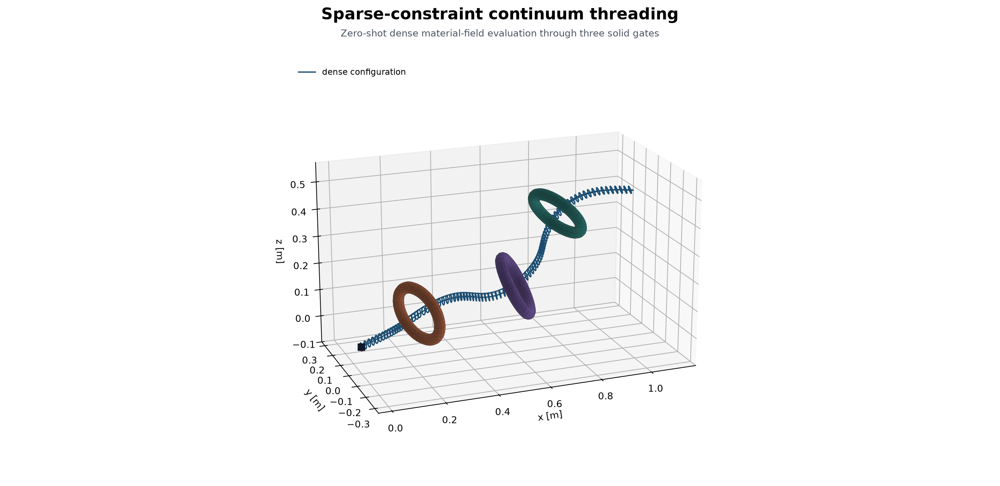
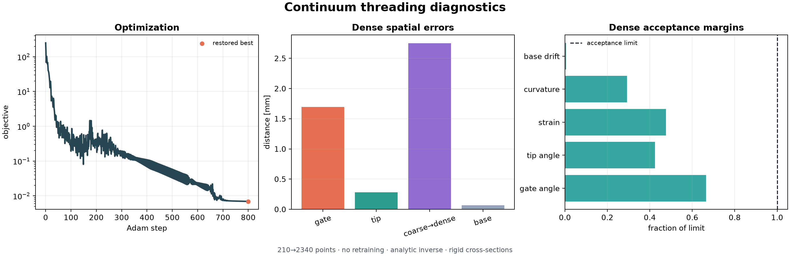

# Sparse-Constraint Continuum Threading

This experiment fits a continuous material-space transformation field from
three gate poses and one tip pose. No target centerline is supplied to the
optimizer. A \(Cl(4,1)\) conformal model supplies an SE(3) generator subspace,
while an RBF sampler varies those generators along the persistent material
coordinate.



## Experiment

The optimization uses 42 cross-sections with four surface samples each,
210 points in total. Ten ordered local actions deform the rod while losses
enforce the sparse gate and tip constraints together with collision, strain,
curvature, base, and smoothness terms.

After optimization, the same field parameters are evaluated directly on
180 cross-sections with twelve surface samples each: 2,340 points with no
additional optimizer step.

The dense evaluation reports:

| Quantity | Result |
| --- | ---: |
| Gate center offset | 1.69 mm |
| Tip position error | 0.28 mm |
| Coarse → dense centerline discrepancy | 2.75 mm |
| Minimum obstacle clearance | 56.5 mm |
| Maximum axial strain | 0.052 |
| Indexed inverse error | \(4.2\times10^{-15}\) |
| Cross-section rigidity error | \(4.3\times10^{-14}\) |

All acceptance checks pass for sparse threading, geometric validity, analytic
inverse and rigidity, and zero-shot dense transfer.



Recorded default run summary:

```text
setup         3 gates + 1 tip pose | 14 RBF controls | 210 optimization points | seed 17
[   0/800] loss=2.496e+02 gate=0.5213 tip=0.6042 orient=159.5° clear=+0.0335 strain=0.010
[ 800/800] loss=6.918e-03 gate=0.0017 tip=0.0003 orient=6.1° clear=+0.0566 strain=0.048
primary      gate 0.0017 m | tip 0.0003 m | clearance +0.0566 m
validation   210→2340 points | gate 0.0017 m | transfer Δ 0.0027 m
numerical    inverse 4.2e-15 | rigidity 4.3e-14 | strain 0.052
optimization best 6.918e-03 at 800 | final 6.918e-03
```

## Run

```bash
uv run --group viz research/transformation_fields/examples/sparse_continuum_threading.py
```

Add `--live` for the interactive optimization view. The canonical saved
artifacts are written to `outputs/sparse_continuum_threading/`.
