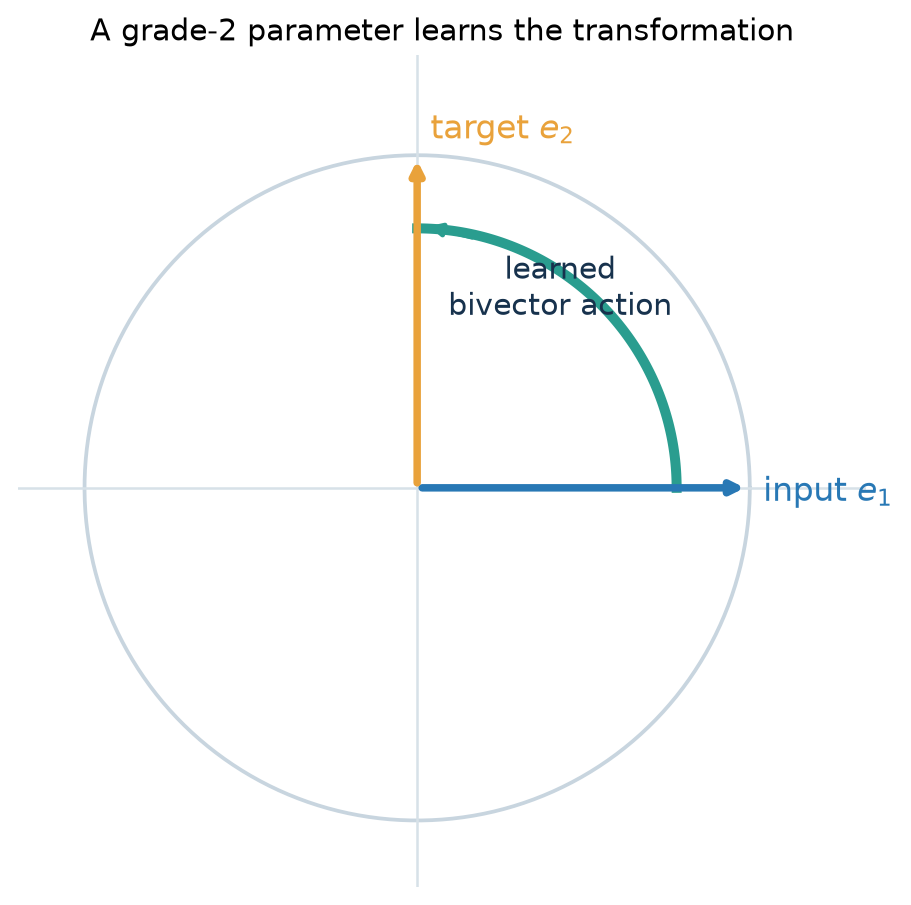

# Learn a Geometric Transformation

A grade-2 `VersorLayer` can learn the rotation from $e_1$ to $e_2$ in
$Cl(2, 0)$. The example contains the complete data, model, optimizer, training
loop, and numerical acceptance condition. The parameter is a bivector; the
forward pass exponentiates it and applies the corresponding rotor action.

## Prepare the Target

```python
import torch

from clifra import make_algebra
from clifra.layers import VersorLayer
from clifra.optimizers import make_riemannian_optimizer

torch.manual_seed(7)

algebra = make_algebra(2, 0, device="cpu")
layout = algebra.layout()

x = algebra.embed_vector(torch.tensor([[1.0, 0.0]])).unsqueeze(1)
target = algebra.embed_vector(torch.tensor([[0.0, 1.0]])).unsqueeze(1)
vector_layout = algebra.layout((1,))
```

Both tensors have shape `[batch=1, channels=1, lanes=4]`.



## Build the Layer and Optimizer

```python
model = VersorLayer(
    algebra,
    channels=1,
    grade=2,
    input_layout=layout,
    output_layout=layout,
)
optimizer = make_riemannian_optimizer(model, algebra, lr=0.08)
```

Grade-2 parameters are tagged as `spin`. The optimizer updates their bivector
coordinates and applies the configured norm guard; the layer's exponential map
constructs the rotor used by the action.

## Train

```python
for step in range(120):
    optimizer.zero_grad()
    prediction = model(x)
    loss = (prediction - target).square().mean()
    loss.backward()
    optimizer.step()

with torch.no_grad():
    prediction = model(x)

print("loss", float(loss.detach()))
print("prediction", prediction.squeeze())
```

With the fixed seed, the loss falls below `1e-4` and the compact vector
coordinates approach the target:

```python
assert float(loss.detach()) < 1.0e-4
prediction_vector = vector_layout.compact(prediction)
target_vector = vector_layout.compact(target)
assert torch.allclose(prediction_vector, target_vector, atol=1.0e-2)
```

This is the smallest example of clifra's learnable-geometric-object approach:
the model does not learn four unrelated output coefficients. It learns a plane
parameter whose algebraic action transforms the input.

The [surface projection tutorial](unbend-manifold.md) places the same
parameterization in a larger experiment with a learned lane gate, analysis,
regularization, and robustness measurements.
